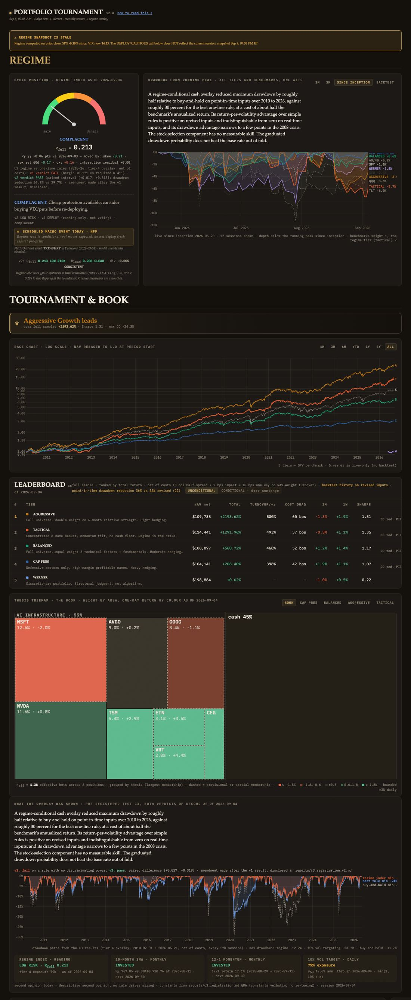
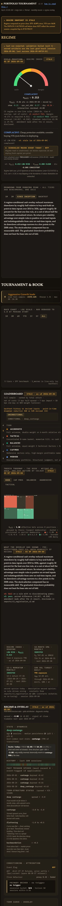
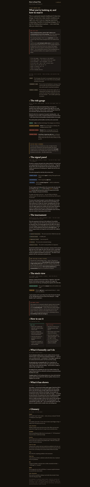
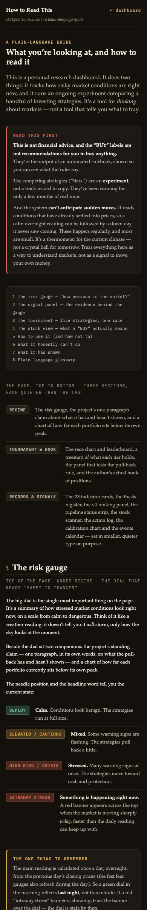
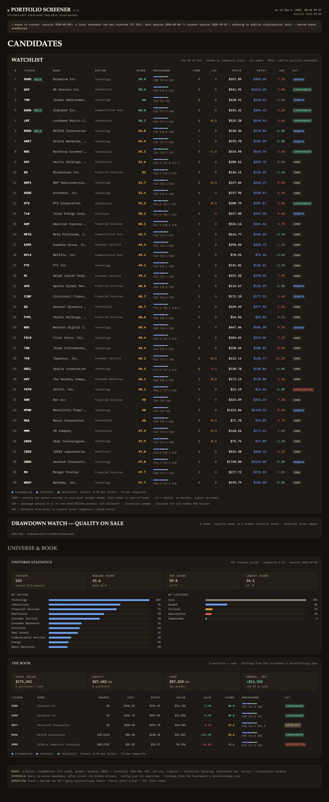
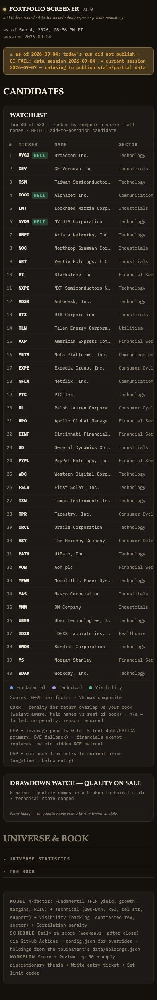

# Execution report — Dashboard Content and Design (order of 9 September 2026)

Executed 2026-09-08/09 against the order's twenty items, one commit per item (P1.1–P5.3; P4.1 and P4.2 share one commit because both panels live in the same script file). Source brief `gaps_and_design_brief.md` is not on this machine; the order states every decision and was executed as written. Nothing in the do-not-touch list was altered: data semantics, as-published values, published vintages, both registries, the referee, the DIAGNOSTIC gate on the overlay scalar, the v4 headline removal, the model-change notes, and the exact wording of the deflated claim.

## 1. Items and commits

| item | what landed | commit |
|---|---|---|
| P1.6 | single file split into `index.html` + `styles.css` + `app.js` (+ `charts.js` in P1.3); Pagella and IBM Plex Mono self-hosted as woff2 converted from the TeX Live OTFs; Google Fonts dependency removed; font URLs relative so they resolve under the Pages subpath (the old absolute `/fonts/` path 404'd on Pages) | fb4485e |
| P1.1 | tokens: spacing `--s1..--s4` (4/8/16/32), type `--t1..--t5` (11/13/15/22/34), three text levels, four semantic colours + accent, categorical set, five-step ±3% diverging scale; every font/margin/padding/gap in the stylesheet snapped to the scales; off-palette hexes and rgba tints → palette colour-mixes | 727dcee, fix ff00afe |
| P1.2 | 261 inline style attributes → 11 (13 after Phase 3's two data-driven bars), all geometry; script-driven migration with an expression-aware scanner; `cc()` runtime colour-to-class mapper so no colour is written into markup | d329a57 |
| P1.3 | one Chart.js configuration (`charts.js`): mono axes / serif titles, sizes from the type scale, hairline gridlines at 1px, surface-card tooltips, semantic palette + two neutrals + tier identities, legends off with direct labels at series ends, weights 1.5 / 1 / 2, animation off after first render; all charts through `CHARTS.make()` | 0f718bd |
| P1.4 | three tiers: tier one full width (gauge + standing moved-by line, the claim sentence, the drawdown chart); tier two (leaderboard and race chart, treemap, retirement panel, regime-and-overlay, the book); tier three one size and one contrast level down by re-binding the tokens in its subtree; section titles at the display size and nothing else at that size | 74f4754 |
| P1.5 | value tweens over `--tween` (200 ms; 0 under reduced motion), badges fade, keyframes reduced to opacity only (nothing bounces or slides), grain 0.03 | 4cfe854 |
| P2.1 | `compute_nav.py` writes `drawdown` per session alongside `nav` for every tier and benchmark (NAVs byte-identical), a summary block, and a declared-cadence JSON companion for the backtest curves; one underwater chart, tier one, all series on one axis, benchmarks weight 1, the regime tier 2, direct labels with the current depth, range 1M / 3M / since inception / backtest | bd132c8 |
| P2.2 | nightly `compute_comparators.py` → `data/comparators.json` (each C3 rule's state, the values it is computed from, the session date; registration constants verbatim; cross-checked against the C3 script at the current rebalance); panel "What the overlay has shown" with the claim verbatim, both verdicts on one line with the amendment noted, the C3 drawdown-path chart, and the second-opinion strip | 4b45709 |
| P2.3 | squarified treemap in plain SVG, weight by area, one-day return by the diverging scale, thesis groups with labels and hairline separators, neutral cash block, dashed provisional/partial memberships, "other" below 0.5%, hover details, N_eff caption; book by default, selector per tier | 5ff13ef |
| P3.1 | `data/holdings.json` the only holdings source (tournament jobs and the screener read it; configuration keys retired; missing file is a hard stop); diff of the former lists reported | d5e0e06 (tournament), 246c382 (screener) |
| P3.2 | the book panel: positions sorted by weight with cost basis, price, unrealized P&L (absolute, percent) and one-day return; totals; thesis bars with N_eff; factor strip beside them | 5ebbe20 |
| P3.3 | nightly `compute_factor_exposure.py`: per-name 252-session regression on SPY, IWM−SPY, IWD−IWF, MTUM−SPY; weight-averaged betas for the book and each tier; proxies added to the nightly download; strip labelled "estimated, 252-session regression" | 9557c6b |
| P3.4 | leaderboard columns TURNOVER/yr and COST DRAG (bps/yr) beside the net return, backtest basis with live-to-date on hover | 26e2b00 |
| P3.5 | `compute_regime_v2.py` writes an R_full delta attribution nightly (top three weighted contributions in R_full points + interaction residual; reproduces the served R_full); rendered as a standing line under the gauge | 7cd6e92 |
| P4.1 | append-only `data/actions.jsonl` written by `compute_nav.py` on any position or sizing change (session, tier, action type, before/after weights, regime and R_full, sha256 of the input snapshot); no retroactive entries; panel with the last 30 newest first, each linked to the session's published vintage row | c68ae59 |
| P4.2 | calibration panel: in-sample and out-of-fold reliability on one axis with the diagonal, base rate marked, out-of-fold Brier beside, the standing caption | c68ae59 |
| P4.3 | `signal_alerts.py` post-publish step: regime band crossing with ±0.02 hysteresis, shock, complacency active/impaired → one labelled GitHub issue per event type per session via the job token, auto-closed on reversion; first run records state only; never fails the nightly | 286947e |
| P5.1 | single column below 820px; tier one always visible incl. the status strip; tier two stacked; tier three under disclosure controls closed by default; type one size down; zero page-level horizontal overflow at 375/390 | ca7813b |
| P5.2 | guide page restyled to the tokens, with "what it has shown" | d3084c4 |
| P5.3 | screener adopts `styles.css` and `charts.js` (copied), hierarchy applied | e4dba4a (screener) |

## 2. Deviations and decisions (each specific)

- **Token names.** The served page's five text-colour tokens were named `--t1..--t5`; the order's type scale takes those names. Text colours became `--text-1/2/3` (old t3/t4/t5 collapse to `--text-3`, raised to `#8A8071` so captions clear 3:1). Legacy aliases keep every old `var()` working.
- **Orange and purple retired.** The palette is the four semantic colours plus the accent; `--o`/`--p` alias to neg/info, and the regime timeline's HIGH RISK segment is a neg/warn colour-mix. Tier identity colours stay as chart series colours (they existed; the palette did not grow).
- **"No other sizes anywhere"** applied to font, margin, padding and gap; component dimensions (chart heights, column widths) are not spacing and were left.
- **Intraday shock/staleness banner** stays above tier one as a live alert; the status strip went to tier three as ordered (and to tier one on mobile, as ordered).
- **Backtest companion is JSON**, not CSV: the referee (untouchable) exempts declared-cadence JSON but would read a dated CSV as stale.
- **Guide page** lived outside the repository (`~/Documents/whl._Trading/How to Read This — Portfolio Tournament.html`); it is now `guide.html` in the repository, linked from the header.
- **holdings.json acquisition dates** are null: the tier-5 configuration never recorded them (a `first_seen_in_tournament` date is carried instead).
- **Grain** was 0.025 on the served page; set to the ordered 0.03.
- **Tween verification**: the verification browser reports the tab as hidden, which throttles frames; the tween completes to the target value there but its interpolation could not be observed in that environment.
- **P4.2 vs the Decision Memo §5.** The memo removed the in-sample reliability figure; this order puts in-sample and out-of-fold curves on one axis. The newer order was followed; the caption says the in-sample curve is the isotonic fit, not evidence.
- **Action log starts empty** (no backfill, as ordered); the first nightly after deploy starts it.
- **Screenshots**: headless Chrome hangs under `--virtual-time-budget` because of the header's infinite pulse animation; screenshots were taken with a navigation timeout instead.

## 3. Acceptance (section 7)

### 3.1 Referee before / after (verbatim, `scripts/audit_nightly.py`)

Before (`reports/audit_before_design.txt`):

```
last trading session: 2026-09-04
[HIGH    ] governance:coverage          5_werner: unclassified share 16% > 15%
[HIGH    ] governance:review_overdue    visibility override AMZN review_by 2026-08-13 passed (decay should be active)
[HIGH    ] governance:review_overdue    visibility override ANET review_by 2026-08-18 passed (decay should be active)
[HIGH    ] governance:review_overdue    visibility override ETN review_by 2026-08-14 passed (decay should be active)
[HIGH    ] governance:review_overdue    visibility override GD review_by 2026-08-12 passed (decay should be active)
[HIGH    ] governance:review_overdue    visibility override MSFT review_by 2026-08-12 passed (decay should be active)
[HIGH    ] governance:review_overdue    visibility override VRT review_by 2026-08-12 passed (decay should be active)
[MEDIUM  ] status:opaque                tournament failure_reason does not name the failing assertion
[INFO    ] tournament:freshness         loco_cv_results.csv: no date axis found (static config?)
[INFO    ] tournament:freshness         ml_indicator_weights.csv: no date axis found (static config?)
[INFO    ] tournament:freshness         pca_loadings.csv: no date axis found (static config?)
[INFO    ] tournament:freshness         pca_variance_explained.csv: no date axis found (static config?)
[INFO    ] tournament:freshness         regime_v3_correlation.csv: no date axis found (static config?)
[INFO    ] tournament:freshness         scored_universe.csv: no date axis found (static config?)
[INFO    ] screener:freshness           scored_universe.csv: no date axis found (static config?)
[INFO    ] screener:freshness           watchlist_top30.csv: no date axis found (static config?)

16 findings; 0 CRITICAL
```

After (`reports/audit_after_design.txt`):

```
last trading session: 2026-09-04
[HIGH    ] governance:coverage          5_werner: unclassified share 16% > 15%
[HIGH    ] governance:review_overdue    visibility override AMZN review_by 2026-08-13 passed (decay should be active)
[HIGH    ] governance:review_overdue    visibility override ANET review_by 2026-08-18 passed (decay should be active)
[HIGH    ] governance:review_overdue    visibility override ETN review_by 2026-08-14 passed (decay should be active)
[HIGH    ] governance:review_overdue    visibility override GD review_by 2026-08-12 passed (decay should be active)
[HIGH    ] governance:review_overdue    visibility override MSFT review_by 2026-08-12 passed (decay should be active)
[HIGH    ] governance:review_overdue    visibility override VRT review_by 2026-08-12 passed (decay should be active)
[MEDIUM  ] status:opaque                tournament failure_reason does not name the failing assertion
[INFO    ] tournament:freshness         loco_cv_results.csv: no date axis found (static config?)
[INFO    ] tournament:freshness         ml_indicator_weights.csv: no date axis found (static config?)
[INFO    ] tournament:freshness         pca_loadings.csv: no date axis found (static config?)
[INFO    ] tournament:freshness         pca_variance_explained.csv: no date axis found (static config?)
[INFO    ] tournament:freshness         regime_v3_correlation.csv: no date axis found (static config?)
[INFO    ] tournament:freshness         scored_universe.csv: no date axis found (static config?)
[INFO    ] screener:freshness           scored_universe.csv: no date axis found (static config?)
[INFO    ] screener:freshness           watchlist_top30.csv: no date axis found (static config?)

16 findings; 0 CRITICAL
```

Finding lines identical; 0 CRITICAL; HIGH limited to the deferred governance items (5_werner partial-weight coverage; six visibility reviews). The one MEDIUM is the served Labor-Day status, which clears with the next successful nightly.

### 3.2 Inline style attributes

| page | before | after | remaining (all data-driven at render time) |
|---|---|---|---|
| tournament (`index.html` → `app.js`) | 261 | 13 | listed below |
| guide | guide | 4 | 0 | — | |
| screener | screener | 48 | 2 | F/T/V breakdown-bar segment weights (custom properties on one element, `index.html:43`); universe distribution bar width (`index.html:166`) | |

Tournament's 13, by line in `app.js`: indicator φ bar width (180), deployment bar width (411), two-score bar width (1261), thesis exposure bar width (1612), correlation heat cell background (1636), regime-timeline bar left/width (1686), scanner quality and trade bar widths (1910, 1916), rank bar width (2124), cash/equity split widths (2274, 2275), factor-strip bar left/width (2563), book thesis bar width (2595).

### 3.3 One chart configuration

`charts.js` exports `CHARTS.make()`; every chart is built through it. Sites calling `CHARTS.make(`: **10** (indicator raw, indicator z, regime timeline, race, ticker, term-structure curve, thesis RS, drawdown, C3 paths, calibration). Direct `new Chart(` calls outside `charts.js`: **0**. Charts constructed at runtime = importers = 10 (the treemap is plain SVG, as pre-answered).

### 3.4 Present and rendering from real data (DOM evidence, local render of the repository)

- underwater chart: 10 live series (5 tiers, 5 benchmarks) with depth labels, tactical at weight 2, benchmarks at 1; backtest range 8 series, 1,026 points;
- retirement panel: three path datasets (regime, 10% vol targeting, buy-and-hold), verdict line "v1: fail … v2: pass, paired difference [+0.017, +0.318]", four second-opinion cells from `comparators.json` (regime LOW RISK · R_full 0.213; SMA invested; momentum invested; vol target 79% exposure);
- treemap: book 9 rectangles incl. cash, 5 dashed partial memberships, group labels with weights, N_eff 1.38; tactical tier 3 dashed provisional memberships, N_eff 3.17; one-day returns across the five bins;
- book panel: 8 positions sorted by weight, totals (55.1% invested, +$15,521 unrealized), two thesis bars, factor strip MARKET +1.18 / SIZE −0.03 / VALUE −0.70 / MOMENTUM +0.16;
- cost and turnover columns: 500% / 60 bps (aggressive), 493% / 57 bps (tactical), 468% / 52 bps (balanced), 398% / 42 bps (cap-pres), Werner not costed;
- standing moved-by line: "R_full −0.06 pts vs 2026-09-03 — moved by: skew −0.21 · spx_ret_60d −0.17 · dxy +0.16 · interaction residual +0.00";
- action log: panel present with the empty-state message (no retroactive entries); `log_actions` unit-tested on a synthetic pair (entry/exit and sizing change logged; same-session recompute logs nothing);
- calibration panel: 4 datasets (diagonal, in-sample 4 bins, out-of-fold 6 bins, base rate 25.9% from Brier 0.1918), caption with out-of-fold Brier 0.1989;
- alerts: `signal_alerts.py` dry-run across five scenarios (first run records; 0.05 inside the band opens; 0.01 suppressed by hysteresis; shock on opens; shock off closes); workflow step with `issues: write`.

### 3.5 One holdings source

`data/holdings.json` is read by `compute_nav.py`, `build_ticker_data.py`, `compute_signals.py`, `compute_factor_exposure.py` and by the screener (cross-repository, local sibling fallback for development). The configuration's `holdings` and `cash` keys are removed; the screener's `portfolio` and `cash` keys are removed. Diff of the two former lists (`reports/holdings_diff_2026-09-09.md`): AVGO, GOOG, MSFT matched; NVDA differed by 0.0224 shares; cash by $0.06; CEG, ETN, TSM, VRT were only in the tournament; BMNR (200.07 shares at 39.05) was only in the screener and is now absent from both, consistently, until Werner adds a line.

### 3.6 Screenshots (headless Chrome, local server on the repository)

Tournament 1400 px: 

Tournament 390 px: 

Guide 1400 px: 

Guide 390 px: 

Screener 1400 px: 

Screener 390 px: 

Horizontal scroll at 390: tournament page-level overflow 0 px at 375/390 (max right edge of any element outside its own scroll container = viewport width; data tables scroll inside their box); guide: scrollWidth = clientWidth = 390 (and 375) inside a 390-pixel frame, no overflowing element; screener: scrollWidth = clientWidth = 390, both tables scroll inside their own box. Method note: headless Chrome on this machine clamps the window to 500 pixels, so a bare 390-wide capture is a cropped 500-pixel layout; the 390 captures were taken inside a 390-pixel iframe harness and cropped, and the overflow numbers come from the framed document.

### 3.7 Contrast (WCAG ratio, computed from the tokens)

| colour | on --bg | on --surface | on --surface-2 |
|---|---|---|---|
| text-1 (body) | 15.18 | 14.11 | 13.09 |
| text-2 (secondary) | 8.19 | 7.62 | 7.06 |
| text-3 (captions) | 4.85 | 4.51 | 4.18 |
| pos / neg / warn / info / accent | 7.90 / 5.54 / 8.29 / 6.72 / 8.33 | 7.35 / 5.15 / 7.71 / 6.25 / 7.74 | 6.81 / 4.78 / 7.15 / 5.80 / 7.18 |
| tier three (text-1 → B3AA9B, text-2 → 8A8071) | 8.19 / 4.85 | 7.62 / 4.51 | 7.06 / 4.18 |

Body ≥ 4.5:1 and captions ≥ 3:1 everywhere. Zero rendered elements outside the type scale (1,974 elements checked).

### 3.8 The claim, and the banned words

The deflated claim appears verbatim on the tournament page twice (tier one beside the gauge; the retirement panel), byte-equal to the memo's sentence (checked in the DOM). On the guide page the claim is carried in the guide's register under "What it has shown" (section 7): "Not nothing — but less than the labels might suggest. Tested from 2010 to 2026 on the information that was actually available at the time, pulling back to cash when the gauge ran high roughly halved the deepest fall a buy-and-hold investor would have sat through. The best simple rule — one that trims exposure whenever the market turns choppy — cut that fall by about 30 percent. The protection had a price: the pulled-back portfolio earned about half of what the market returned over the period. It has shown no reliable advantage in returns, and on return for the risk taken it is not clearly better than the simple rules. The stock-picking half — the individual BUY and SELL calls — has no measurable skill. So what it has shown is a smoother ride for a smaller return, and nothing more." The words "edge" and "alpha" (word boundaries, case-insensitive) appear 0 times in the tournament page's rendered text (one hysteresis footnote said "edge-flapping" and was reworded); guide page 0 (the source's "no proven edge" was reworded, and tier 4 is called "Tactical"); screener page 0.

### 3.9 Page weight and first render (local server, same machine, warm cache)

| | before | after |
|---|---|---|
| HTML + own CSS/JS | 184,680 B (one file) | 244,263 B (index 1,162 + styles 58,611 + app 177,999 + charts 6,491) |
| external libraries (Chart.js, adapter, annotation, PapaParse) | 309,841 B | unchanged |
| fonts | Google Fonts (external) | 551 KB self-hosted woff2, eight faces, preloaded |
| data fetched at render | 7.86 MB | 8.14 MB (+ backtest drawdown companion 322 KB, comparators, factor exposure, C3 paths, holdings) |
| app rendered after navigation | 1,235 ms | 283 ms |

The render figure is the time from navigation start until the regime card exists in the DOM, measured by polling in the page; both runs on the same local server with a warm cache. The data payload dominates weight before and after; it is unchanged in kind.

## 4. What the nightly does from tonight

Order of jobs in `update_daily.py`: refresh_data → compute_regime_v2 (now with `attribution`) → compute_comparators → v4 scorer → compute_nav (drawdown, action log, backtest companion) → compute_factor_exposure → the rest; then the audit, the commit, and the signal-alerts step (first run records state, opens nothing). The screener's next run fetches `holdings.json` from the tournament repository, so the tournament is pushed first.

## 5. Open items

- The screener's served `scores.json` still carries the last published book (five names including BMNR); the next screener run (23:15 UTC) reads `holdings.json` from the pushed tournament repository and republishes the eight-name book.
- The action log, the alert state, the comparators, the factor exposure and the attribution line are written by the first nightly after deploy; the alerts step records state only on that run.
- Chart.js and its adapter and annotation plugin still load from jsDelivr on the tournament page (they did before; the order allowed no additional library and did not ask to self-host the existing ones).
- Guide screenshots and the guide's overflow figures were produced by the delegated task with the same headless-Chrome method; the tournament's and screener's 390 captures were retaken through the iframe harness after the clamp was discovered.
