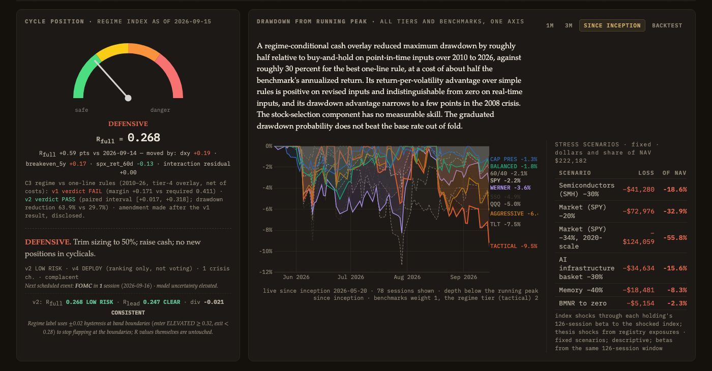
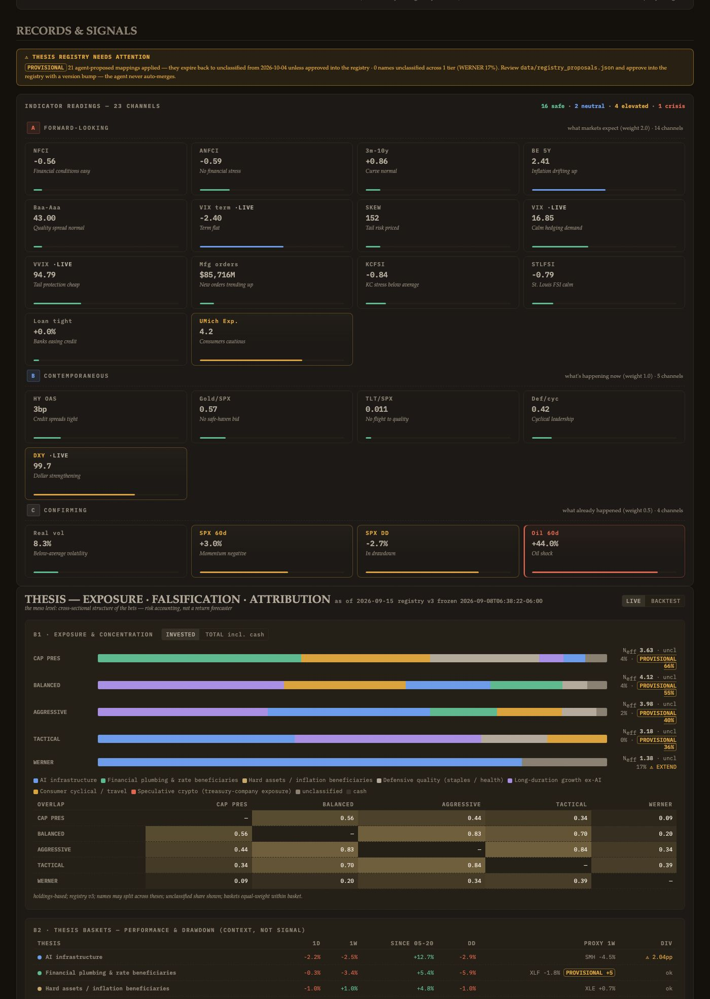

# Phase 1 report — Fix the book, put the analytics on it

Execution Order of 16 September 2026, Phase 1 (items 1.1–1.7). Executed 16 September 2026, 11:59–13:00 CST (before the 16-Sept close; the price store's last session at execution was 2026-09-14, see §5).

Commits, in order (portfolio-tournament unless stated):

| commit | item |
|---|---|
| 90d8750 | [1.0] Repair before Phase 1 (referee crash, null attribution, price-fetch lag, frozen declared date) — §2 |
| fbdd75e | [1.1] Holdings from the account |
| f20b9a4 | [1.2] Held names are always in the universe (tournament) |
| 9a44340 | [1.2] Held names are always on the board (portfolio-screener) |
| 398ecfa | [1.3] Book analytics, nightly |
| 0813141 | [1.4] Posture versus every rule, at the book's beta |
| 07c74a1 | [1.5] Stress scenarios |
| 8e2228e | [1.6] Diversification sleeves, first version |
| 95098e3 | [1.7] Position signals on the real book |
| 628e0d4 | [1.7] amendment for acceptance 8 (entry-mode records descriptive; overflow fix) |

## 1. Referee, verbatim

### Before Phase 1 (`reports/audit_2026-09-16_phase1_before.txt`)

```
last trading session: 2026-09-15
Traceback (most recent call last):
  File "/Users/whl/portfolio-tournament/scripts/audit_nightly.py", line 305, in <module>
    sys.exit(main(troot,sroot))
             ^^^^^^^^^^^^^^^^^
  File "/Users/whl/portfolio-tournament/scripts/audit_nightly.py", line 244, in main
    if c and abs(c.get('active',0)-(c.get('cash_eff',0)+c.get('alloc_eff',0)+c.get('selection',0)))>1e-4:
                                    ~~~~~~~~~~~~~~~~~~~^~~~~~~~~~~~~~~~~~~~~
TypeError: unsupported operand type(s) for +: 'NoneType' and 'NoneType'
```

This is the same traceback the 15-Sept nightly produced on the runner (run 35038445488) and the screener's 16-Sept run (35043869997). Both workflows have been failing on it; `status.json` recorded the crash as `"n_findings": 0`.

### After the repair, before item 1.1 (`reports/audit_2026-09-16_phase1_after_repair.txt`)

```
last trading session: 2026-09-15
[HIGH    ] tournament:dead_columns      regime_v4_daily.csv: columns empty for last 5+ rows but populated earlier: ['p_15_20_elastic_net', 'p_15_40_logistic_pc', 'p_15_60_logistic_pc']
[HIGH    ] xfile:vol_single_source      intraday vix 16.85 vs canonical 17.2
[HIGH    ] nullguard                    intraday.vvix is null; dependent safety checks must read IMPAIRED not false
[HIGH    ] governance:coverage          5_werner: unclassified share 17% > 15%
[HIGH    ] governance:review_overdue    visibility override AMZN review_by 2026-08-13 passed (decay should be active)
[HIGH    ] governance:review_overdue    visibility override ANET review_by 2026-08-18 passed (decay should be active)
[HIGH    ] governance:review_overdue    visibility override ETN review_by 2026-08-14 passed (decay should be active)
[HIGH    ] governance:review_overdue    visibility override GD review_by 2026-08-12 passed (decay should be active)
[HIGH    ] governance:review_overdue    visibility override MSFT review_by 2026-08-12 passed (decay should be active)
[HIGH    ] governance:review_overdue    visibility override NVDA review_by 2026-09-09 passed (decay should be active)
[HIGH    ] governance:review_overdue    visibility override VRT review_by 2026-08-12 passed (decay should be active)
[INFO    ] tournament:freshness         loco_cv_results.csv: no date axis found (static config?)
[INFO    ] tournament:freshness         ml_indicator_weights.csv: no date axis found (static config?)
[INFO    ] tournament:freshness         pca_loadings.csv: no date axis found (static config?)
[INFO    ] tournament:freshness         pca_variance_explained.csv: no date axis found (static config?)
[INFO    ] tournament:freshness         regime_v3_correlation.csv: no date axis found (static config?)
[INFO    ] tournament:freshness         scored_universe.csv: no date axis found (static config?)
[INFO    ] screener:freshness           scored_universe.csv: no date axis found (static config?)
[INFO    ] screener:freshness           watchlist_top30.csv: no date axis found (static config?)

19 findings; 0 CRITICAL
```

### After Phase 1 (`reports/audit_2026-09-16_phase1_after.txt`)

Identical to the reading after the repair: 19 findings, 0 CRITICAL. The HIGH findings are the deferred governance items (visibility reviews, the tier-5 unclassified share under registry v3 — cleared by v4 in Phase 3), the v4 monthly columns, and the two intraday-bot findings (VIX single source, VVIX null), none of which this order touches. A MEDIUM finding that appeared on the first after-run (`ticker_signals.json: no declared as_of/session_date`) was caused by the local re-run of the signal job; the job now self-stamps `session_date` and `prices_through`, and the finding is gone.

## 2. The repair (commit 90d8750) — what the "before" reading exposed

Taking the before reading surfaced four defects. None is in the order; all four had to be fixed for the referee to read anything, and two of them concern served data. Nothing as-published was rewritten.

1. **The referee crashed on served nulls.** The attribution identity check added `None + None`. The crash exited 1, was parsed as zero findings, and both nightlies have been red since 14-Sept. A null component is now a CRITICAL `identity:attribution` finding (the same severity the non-summing identity already carries); blocking semantics are unchanged.
2. **The attribution went null because the runner's pandas 3 no longer pads `pct_change`.** The 15-Sept sector-ETF row was written all-NaN (the provider returned the index entry before the bars); the SPY return became NaN and every component went null. `compute_thesis_daily.py` now uses `fill_method=None` explicitly, skips a session without a SPY return and lists it in `attribution[tid].skipped_sessions`, and asserts finite components. `thesis_daily.json` (with `registry_proposals.json`) was regenerated by the repaired job from the committed inputs; the served nulls are gone. Under pandas 3 the session 2026-09-15 is skipped for every tier (n_days 76, `skipped_sessions ["2026-09-15"]`).
3. **The price fetch ran a session behind.** `refresh_data.py` bounded `yf.download` with `end = now`; on the runner's UTC clock at ~20:00 ET the just-closed session fell outside the exclusive window (the 14-Sept run's store ended at 09-11, the 15-Sept run's at 09-14). The bound is now tomorrow; all-NaN rows and non-session rows are dropped from every store, with a log line.
4. **`tournament.json`'s declared `session_date` read 2026-09-04** since the day the stamping pass first wrote it (the pass kept whatever it found; the history advanced). The producer (`compute_nav.py`) now stamps it; the stamping pass never lets an older stamp outrank a newer content date; the served stamp was set to the history's last row, 2026-09-15.

### 2.1 A data finding outside the order: published rows carry the previous session's closes

Cross-checking the store and the tournament history against a fresh download:

| session | NVDA close (fresh download) | tournament row NVDA price | AVGO fresh / row | SPY fresh / row |
|---|---|---|---|---|
| 2026-09-08 | 225.48 | 225.73 | 368.56 / 368.56 | 765.96 / 765.96 |
| 2026-09-09 | 223.42 | 225.73 | 364.38 / 368.56 | 762.40 / 765.96 |
| 2026-09-10 | 218.36 | 218.36 | 360.83 / 360.83 | 757.83 / 757.83 |
| 2026-09-11 | 218.29 | 218.36 | 361.99 / 360.83 | 764.29 / 757.83 |
| 2026-09-14 | 210.96 | 218.29 | 344.72 / 361.99 | 760.88 / 764.29 |
| 2026-09-15 | 212.17 | 210.96 | 339.27 / 344.72 | 757.39 / 760.88 |

(NVDA's 09-08/09-09 figures differ by a dividend adjustment; the shift is the finding.) The rows published for 09-09, 09-11, 09-14 and 09-15 hold the prior session's closes: `compute_nav.py` fetched `period="5d"` and took the last bar the provider served, and on those evenings the just-closed session was not there. The store's own 09-14 row is correct; its 09-11 row is 99.8 percent NaN (a source gap, kept).

Published rows are not rewritten (as-published values stand). What changed: `compute_nav.py` now selects the close bar *of* the session being published and stops with `ASSERTION bar_session_mismatch` when the provider has none; `update_daily.py`'s validator rejects a run whose price store ends before the publish session or whose SPY row price differs from the store's close by more than 0.5 percent. A rejected run keeps the last good board and names the assertion in `status.json`. Tonight's nightly is the first test of both; if the provider still has no bar at 20:00 ET the run will reject rather than mislabel, and the cron should then move later (Phase 6.4 sets the single workflow's time).

## 3. Item by item

**1.1 Holdings.** `data/holdings.json` committed exactly as ordered (seven positions, cash 74,527.68, source "brokerage positions, 2026-09-16 (manual transcription; replaced by CSV ingestion in Phase 2)"). Read-only until Phase 2's ingestion replaces it.

**1.2 Universe rule.** `refresh_data.py` fetches full history for a held name the store has never seen and appends it to `data/canonical/universe.txt`; `score_universe.py` scores a held name from 120 sessions on the metrics its history supports; `build_ticker_data.py` emits a short-listed held name marked "no signal (insufficient history)" and an unpriced held name marked "no price history". The screener appends a held name outside the top 40 to the board with its true rank and `on_board_as: "held"` — MU (rank 178 on the 15-Sept board) appears at the screener's next run. GEV, ANET and BMNR were already columns of the price store and rows of the tournament's scored universe (ranks 134, 52 and 427 of 537); they enter `ticker_signals.json` as held names (present in the local run: 53 signal records, 7 in position mode).

**1.3 Book analytics.** `scripts/compute_book.py` + `scripts/book_analytics.py` → `data/book.json`, registered in the nightly after `compute_regime_v2.py` and before `compute_comparators.py`; the book panel renders every figure (screenshot §6). Definitions as pre-answered: 126 sessions of daily simple returns, OLS with intercept, sample volatility × √252, risk share w_i(Σw)_i / wᵀΣw with w over NAV and cash at zero volatility, effective bets = exponential entropy of the equity correlation eigenvalues, effective theses = 1/Σw² over the registry exposure of the invested sleeve. Portfolio beta is Σ w β over position betas (with cash: w over NAV; sleeve: w over equity); the constant-weight sleeve regression is reported beside it (2.47 both ways).

**1.4 Posture at the book's beta.** `comparators.json` gains `book_posture`: for each tier's regime schedule, the three registered rules and volatility targeting at 10 and 15 percent — the index share, the share translated to the book (index share ÷ equity-sleeve beta, capped at 100 percent), the actual equity share; volatility targeting on the book uses the book's own realised volatility (60-session registered window, 126-session figure beside). A posture card renders the table; the second-opinion strip carries each rule's translated share.

**1.5 Stress.** In `book.json` (`stress`): SMH −30, SPY −20, SPY −34 ("2020-scale") through each holding's 126-session beta to the shocked index; AI-infrastructure basket −30 by registry membership weight; memory −40 over the memory names; BMNR to zero. Dollars and share of NAV, method on hover; rendered beside the drawdown chart inside the drawdown card.

**1.6 Sleeves.** In `book.json` (`sleeves`): XLP, XLE, XLF, XLU, TLT, GLD, IWM and the screen view's quality-passing names (fundamental ≥ 18, visibility ≥ 15 — the shelf's bar) that carry a registry thesis, correlation to the equity book's constant-weight series, ascending, with the standing note. Held names excluded.

**1.7 Position signals.** Position mode computes the stop from the cost basis under the category rule and carries `cost_basis`, `stop_from_cost`, `stop_rule` and `label: "mechanical rulebook; expectancy not validated"`; `signal_strength` and `trade_now_strength` are null. Observations replace imperatives, e.g. for AVGO: "price $344.72 is 18.7 percent below the trailing level of $423.78 (-12 percent from the $481.57 peak, 0–25% bracket); +24.1 percent from the rulebook stop of $277.74 (from cost, -15 percent rule (Compounder))"; for NVDA: "position is +143 percent on cost; the rulebook's trim level was +100% (20 percent of the position at that level)". The UI renders the label on every signal box, position and entry.

## 4. Numeric acceptance

Computed through the 2026-09-14 close (the last session in the price store at execution; §5). The auditor's figures are reproduced, which fixes the data both were computed on.

| figure (§1.3–1.6, acceptance 2) | order | computed | note |
|---|---|---|---|
| MU risk contribution share | about 57% | 57.5% | w over NAV, cash at zero volatility |
| portfolio beta with cash | about 1.66 | 1.64 | Σ w_nav β (SPY, 126-session OLS) |
| equity-sleeve volatility | about 47% | 47.4% | 126 sessions; 60-session figure 47.1% |
| effective bets | about 5.1 | 5.13 | exponential entropy of 7 eigenvalues |
| effective theses | 1.3 to 1.5 | 1.55 | registry v3: GEV unclassified (14.8% of equity); 1.30 under v4 with GEV 0.6 in ai_infra (Phase 3) |
| vol targeting at 10% on the book | about 21% in equities | 21.2% | 0.10 / σ60 book 47.1% |
| full-range regime posture translated | about 40% | 40.5% at full deployment (cash at the floor); 29.6% at today's R_full 0.268 | the order's figure matches the schedule's full deployment; both are shown |
| SPY −34% scenario | about 57% of the portfolio | 55.8% of NAV | 1.64 × 0.34 |
| staples correlation | about −0.45 | −0.44 | XLP, n 124 |
| energy | about −0.27 | −0.28 | XLE |
| financials, utilities | near zero | −0.02, −0.03 | XLF, XLU |

Other figures of record: NAV $222,182 = equity $147,655 + cash $74,528 (invested 66.5%); equity-sleeve beta 2.47 (to SMH 0.85 sleeve); vol with cash 31.5%; MU $46,202 at $924.03, β SPY 3.6, vol 94.8%; GEV −4.3% on cost, BMNR −34.0% on cost; TLT +0.24, GLD +0.42, IWM +0.66 correlation.

Acceptance 3: GEV, ANET, BMNR are in the tournament universe with signals (position mode); MU is scored on the screen view (rank 178) and joins its board at the next run. Acceptance 4: no held-name signal box displays an imperative; every box carries the label; position-mode records carry `cost_basis` and `stop_from_cost` (verified in the browser: 0 occurrences of BUY/SELL in rendered text after the amendment, the label rendered twice on the open AVGO detail). Acceptance 8, early: the words edge and alpha do not appear in rendered text; entry-mode records for non-held names are now descriptive readings ("ENTRY CONDITIONS 4/5 · STRONG 3/4", "CAUTION FLAGS 2/3", "EXTENDED · 17% ABOVE MA200").

## 5. Deviations and judgment calls

- **Session of the figures.** The order's acceptance is stated "for the 16 September close". At execution (13:00 CST) the close had not happened and the store's last session was 2026-09-14 (§2, item 3). The figures above reproduce the auditor's to within rounding, so they were computed on the same data; the nightly recomputes everything through the 16-Sept close tonight.
- **The stop example in 1.7** ("$369.45 from cost $326.75, −15 percent rule") is not reproducible: cost × 0.85 = $277.74. The record states its arithmetic (`stop_rule`), and $277.74 is what it shows.
- **"Full-range regime posture ≈ 40 percent"** matches the tactical schedule at full deployment (cash at its floor of 0). At today's R_full the tactical posture translated is 29.6 percent. Both are on the posture card.
- **Effective theses 1.55** is above the 1.3–1.5 band because registry v3 leaves GEV unclassified; the v4 registry of Phase 3 (GEV 0.6 in ai_infra) gives 1.30.
- **"Memory −40%"** uses the v3 queue's memory_semis proposal (MU, SNDK ∩ book = MU) until the v4 `sub` field exists; the source is stated in the scenario's method.
- **Book page.** There is no Book page until 6.3; the panels render in tier two of the current single page and move to `book.html` in Phase 6. The stress panel sits inside the drawdown card beside the chart.
- **Universe membership** of GEV/ANET/BMNR did not need "entering tonight": they were already members; the rule is now enforced for any future held name.
- **Acceptance 8 addressed early on the tournament page** (entry-mode wording, scanner chips, the shock banner's instruction) so tonight's deploy already complies; the screener's board wording is handled with the merge.
- **The repair commit** precedes item 1.1 as [1.0]; `update_daily.py` in that commit also registers `compute_book.py` (committed in [1.3]) — no deploy happens between commits.
- **Regenerated served files** in the repair: `thesis_daily.json` and `registry_proposals.json` from the committed inputs by the repaired job; `tournament.json` changed only in its declared `session_date`/`cadence` stamp. `comparators.json`, `ticker_signals.json`, `book.json` were produced locally by the Phase 1 jobs from the committed inputs (the venv runs pandas 3.0.3 against the runner's 3.0.5).

## 6. Screenshots (1400 px, headless Chrome, local server)





Page-level horizontal overflow at 1400 px: 0 (the tier-two and drawdown grids were given `minmax(0,1fr)` columns; the 17-column book table scrolls inside its card).

## 7. Open until tonight's nightly

- The bar-session assertion and the end-bound fix are exercised for the first time at 22:00 UTC. A rejection would show as `ASSERTION bar_session_mismatch` / `PRICE_STORE_SESSION` in `status.json` with the last good board preserved.
- `book.json`, `comparators.json` (with `book_posture`), `ticker_signals.json` recomputed through the 16-Sept close; the sector-ETF store gains its 09-15 and 09-16 rows.
- The screener's 23:15 UTC run applies [1.2] (MU on the board).
