# Phase 6 report — The merge

Execution Order of 16 September 2026, Phase 6 (items 6.1–6.5). Executed 16 September 2026, 14:00–14:45 CST. Commits: `git log --grep='^\[6\.'` in portfolio-tournament and portfolio-screener.

## 1. Referee, verbatim

**Before Phase 6** is the reading after Phase 5 (`reports/audit_2026-09-16_phase5_after.txt`, 20 findings, 0 CRITICAL), taken with the second tree at `../portfolio-screener/data`.

**After Phase 6** — one run, one repository, discovery over `data/` and `data/screen/` (`reports/audit_2026-09-16_phase6_after.txt`):

```
last trading session: 2026-09-15
[HIGH    ] tournament:dead_columns      regime_v4_daily.csv: columns empty for last 5+ rows but populated earlier: ['p_15_20_elastic_net', 'p_15_40_logistic_pc', 'p_15_60_logistic_pc']
[HIGH    ] xfile:vol_single_source      intraday vix 16.73 vs canonical 17.2
[HIGH    ] nullguard                    intraday.vvix is null; dependent safety checks must read IMPAIRED not false
[HIGH    ] governance:coverage          5_werner: unclassified share 17% > 15%
[HIGH    ] governance:review_overdue    visibility override AMZN review_by 2026-08-13 passed (decay should be active)
[HIGH    ] governance:review_overdue    visibility override ANET review_by 2026-08-18 passed (decay should be active)
[HIGH    ] governance:review_overdue    visibility override ETN review_by 2026-08-14 passed (decay should be active)
[HIGH    ] governance:review_overdue    visibility override GD review_by 2026-08-12 passed (decay should be active)
[HIGH    ] governance:review_overdue    visibility override MSFT review_by 2026-08-12 passed (decay should be active)
[HIGH    ] governance:review_overdue    visibility override NVDA review_by 2026-09-09 passed (decay should be active)
[HIGH    ] governance:review_overdue    visibility override VRT review_by 2026-08-12 passed (decay should be active)
[INFO    ] tournament:freshness         loco_cv_results.csv: no date axis found (static config?)
[INFO    ] tournament:freshness         ml_indicator_weights.csv: no date axis found (static config?)
[INFO    ] tournament:freshness         pca_loadings.csv: no date axis found (static config?)
[INFO    ] tournament:freshness         pca_variance_explained.csv: no date axis found (static config?)
[INFO    ] tournament:freshness         regime_v3_correlation.csv: no date axis found (static config?)
[INFO    ] tournament:freshness         scored_universe.csv: no date axis found (static config?)
[INFO    ] screener:freshness           scored_universe.csv: no date axis found (static config?)
[INFO    ] screener:freshness           watchlist_top30.csv: no date axis found (static config?)
[INFO    ] book:export                  no brokerage export on record (holdings_export.json absent); holdings.json source: brokerage positions, 2026-09-16 (manual transcription; replaced by CSV ingestion in Phase 2)

20 findings; 0 CRITICAL
```

Zero CRITICAL; the same HIGH set. The screen view's tree is now audited from inside the repository; the cross-repository blocking logic is gone (`audit_status.py --scope all`: every CRITICAL blocks the single deploy).

## 2. Item by item

**6.1 Repository.** The screen view's code is under `scripts/screen/` (`score_universe.py`, `build_json.py`, `reconcile_views.py`, `oneoff/board_delta.py`, `config.json`) with paths changed and nothing else (each file says so on its first line); its served data under `data/screen/` (`scores.json`, `status.json`, `scored_universe.csv`, `watchlist_top30.csv`, `portfolio_report.txt`, `universe_535.txt`, `visibility_registry.json` with every provenance field — sha256 `9ab9eff5af26168c1526ae3f3fa55335a8970a6e9ab8426de76df560debac7ab` in both repositories — and the 29 session vintages, 87 files, diff-identical). The canonical artifact and the holdings are read locally (the published URLs remain recorded fallbacks). The copied stylesheet, chart module and fonts in the screener repository are deleted in favour of the originals; the screen view's own rules live in `screen.css`. The repository stays public.

**6.2 One universe.** `scripts/build_universe.py` builds `data/universe.txt` nightly as the union of the tournament's canonical universe (537), the screen view's universe (535 + 47 midcap additions = 537) and the held names (7); both scoring views consume it, and the price refresh fetches full history for any union name the store has never seen. **Union size: 537.** Names in only one universe: none — the two universes coincide (BMNR and TSM are the only names the screen's historical file lacks, and both are midcap additions); held names added: none. Recorded in `data/universe_meta.json`.

**6.3 Pages.** Seven pages plus the guide, sharing `styles.css`, `charts.js`, a common data loader (`common.js`: FILES registry, `loadFiles(keys)`, the navigation strip) and per-page compositions (`pages.js`; the screen view in `screen.js`). Each page fetches only the files it renders (`PAGES[page].loads`):

| page | what it holds | files fetched |
|---|---|---|
| `index.html` | regime gauge with the moved-by line, the claim sentence, the drawdown chart with the stress panel, the status strip; context (overlay panel, timeline, deployment); readings (indicators, calendar) | 18 |
| `book.html` | the book analytics (1.3), the sizing card (1.4/4), stress (1.5), sleeves (1.6/5), the position readings (1.7) | 11 |
| `screen.html` | the board (held names always on it), the drawdown shelf, the visibility registry (every field), the reconciliation panel, universe statistics, the book as the screen sees it | 5 |
| `tournament.html` | leaderboard with race chart and tier details, treemap, thesis exposure and attribution, scanner | 17 |
| `evidence.html` | the retirement tests with both registrations and the C3 path chart, the calibration panel, the C2 vintage comparison, the graduated model's ranking panel | 13 |
| `register.html` | the register (claims, disconfirmers, kill criteria, log), the provisional ledger, the proposals | 7 |
| `system.html` | pipeline and referee status, the no-publish count, the action log, the universe | 10 |

The reconciliation panel: Spearman rank correlation between the two views on 533 common names — composite **0.541**, technical 0.267, fundamental 0.660 — and the ten largest percentile-rank divergences with a mechanically attributed cause (screen-only components converted to rank points by counterfactual re-ranking; otherwise the larger factor disagreement):

| name | tournament → screen rank | gap (pct pts) | attributed cause |
|---|---|---|---|
| RCL | 16 → 487 | 88 | fundamental disagreement (51 rank pts) |
| EIX | 66 → 470 | 76 | technical disagreement (62 rank pts) |
| NCLH | 122 → 522 | 75 | technical disagreement (55 rank pts) |
| PCG | 123 → 521 | 75 | technical disagreement (49 rank pts) |
| ESTC | 484 → 100 | -71 | fundamental disagreement (-62 rank pts) |
| MPWR | 12 → 391 | 71 | broken base cap (53 rank pts) |
| D | 125 → 502 | 71 | fundamental disagreement (44 rank pts) |
| LMT | 382 → 4 | -70 | fundamental disagreement (-38 rank pts) |
| RTX | 381 → 12 | -69 | visibility override excess (-60 rank pts) |
| CRWV | 126 → 485 | 68 | fundamental disagreement (33 rank pts) |

Rendering: every page checked in the browser at 1400 and 390 pixels, no console errors after the split, page-level horizontal overflow 0 at both widths on all eight pages (the position readings' two-score rows stack below 820 px). The words edge and alpha do not appear in rendered text; no page carries a buy or sell recommendation (the verdict lines, the deployment map, the tier hedging note and the event-day caption were reworded as readings of the schedules; the screen's board reads "LEVEL" for the screen's base level and the footer no longer lists entry tickets or limit orders).

**6.4 One workflow.** `.github/workflows/nightly.yml` replaces `daily_update.yml` and the screener's `rescore.yml`: `scripts/update_daily.py` runs, in the order stated, the canonical closes (`build_universe`, `refresh_data`), the regime and volatility layers, both scoring views (`build_canonical`, `score_universe`, `screen/build_json`, `screen/reconcile_views`), signals, book analytics, comparators, thesis and attribution; then the referee sweeps `data/` and `data/screen/`; then the publish step. A second schedule at 01:30 UTC retries only when the close run was rejected for a missing close bar (the finding of Phase 1); a published session is never re-run and the published vintage is append-only in any case. The intraday bot (`intraday.yml`, `market_open.yml`) and the monthly rebalance are unchanged.

**6.5 Retire the old site.** The screener repository's `index.html` is a redirect (meta refresh, canonical link and a script) to `/portfolio-tournament/screen.html`; its workflow, copied stylesheet, chart module and fonts are removed; its README says where everything went. The repository is to be archived read-only after one week of the redirect serving — on or after **2026-09-23**:

```bash
gh repo archive wernerhl/portfolio-screener --yes
```

## 3. Screenshots (headless Chrome; the 390 px captures through a 390 px frame)

### index

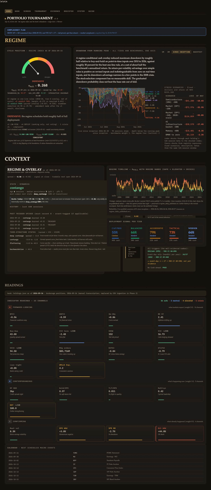

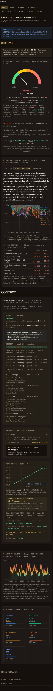

### book

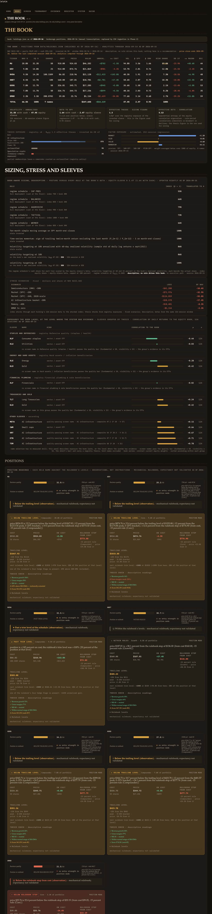

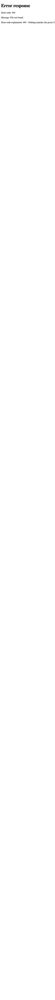

### screen

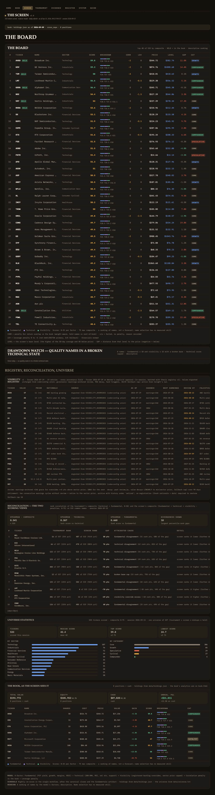

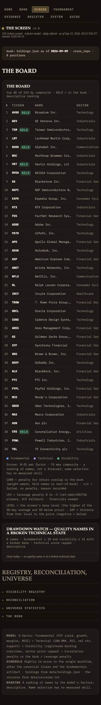

### tournament

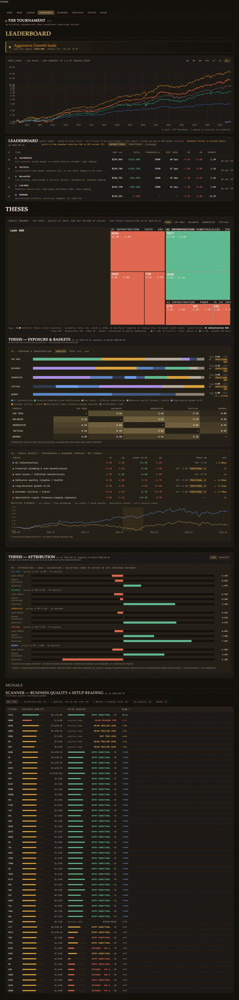

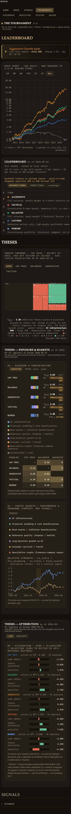

### evidence

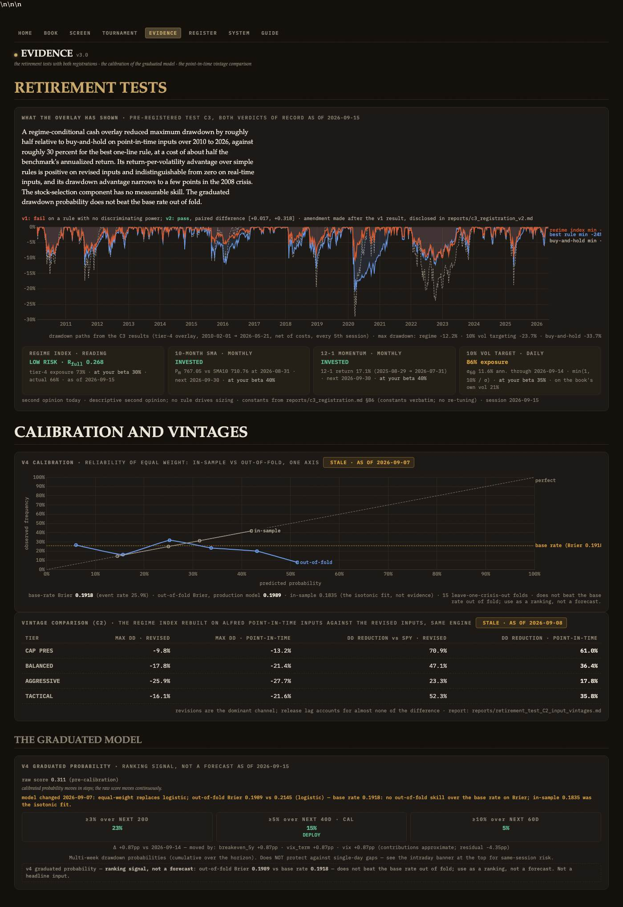

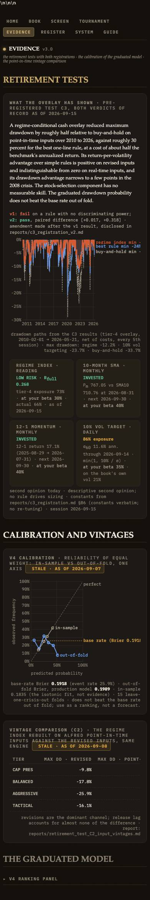

### register

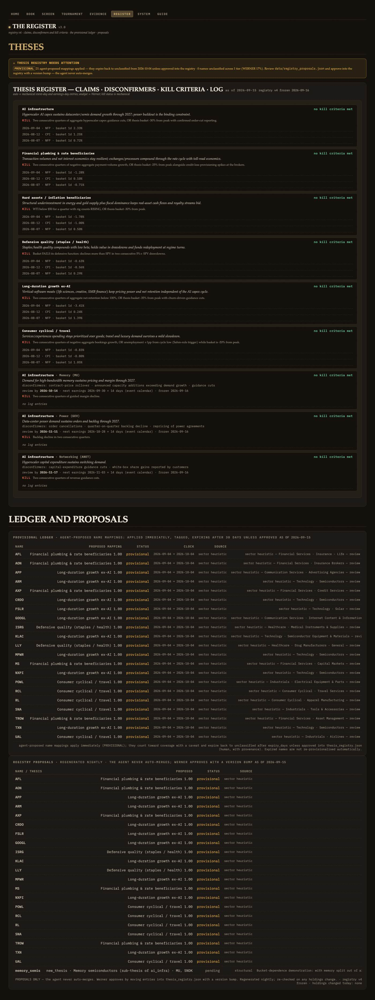

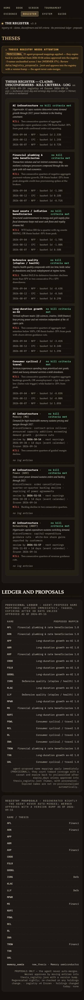

### system

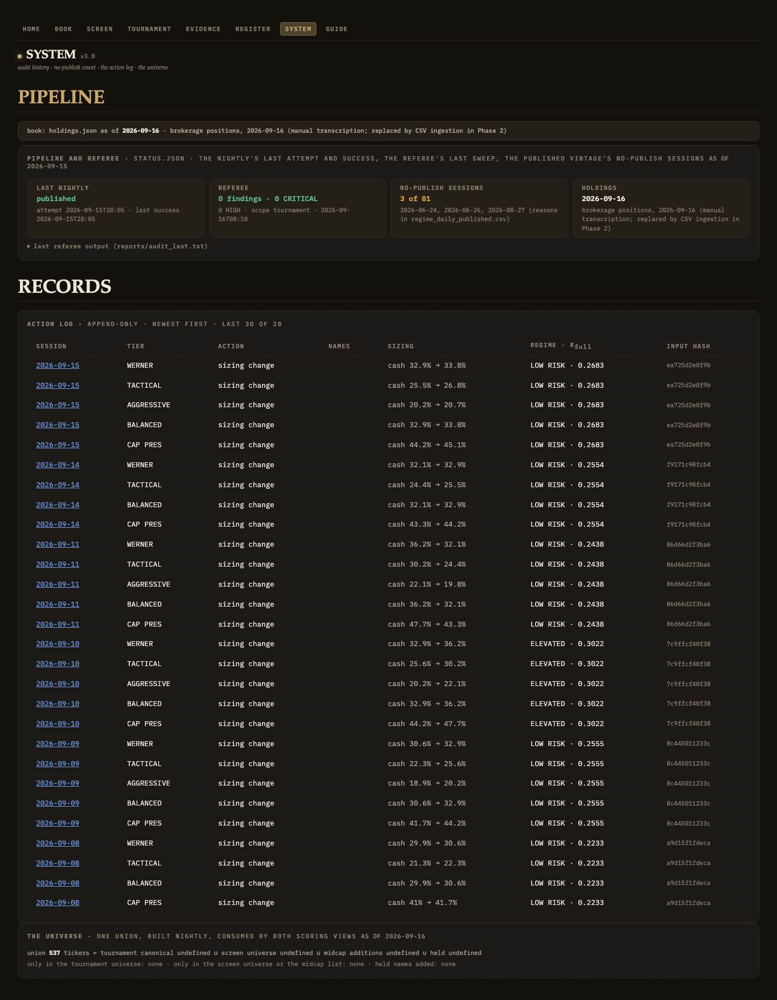

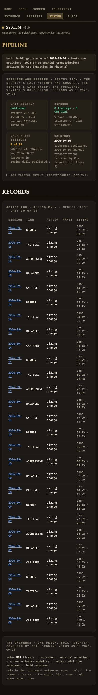

### guide

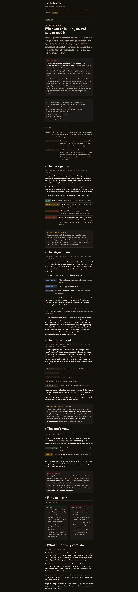

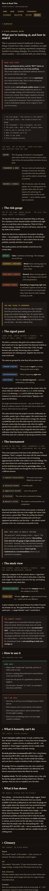


## 4. Deviations and observations

- **Archiving** is dated, not done: the order says after one week of the redirect serving.
- **Four names** (BK, CFLT, PSTG, SATS) return "Quote not found" from the provider every run; they stay in the canonical universe and therefore in the union until the canonical fetch drops them. Reported by the relocation agent.
- **The screen's `session_date`** derives from the price index after the SPX top-up; in the merged nightly both views run on the same store, so the stamp and the canonical session agree.
- **The tournament's scoring view now runs nightly** (it ran monthly); tier selection stays monthly (`monthly_rebalance.yml`), so the tiers' composition is unchanged by this.
- **Tier-five detail on tournament.html** still shows the 15-Sept positions (the old book) until tonight's NAV row; the book page reads holdings.json directly.
- **The stress panel** appears on the home page beside the drawdown chart (as item 1.5 places it) and on the book page (Phase 1 panels on the Book page).
- **Screenshots**: the 1400 px captures were trimmed of trailing background; two pages exceed the 6000 px capture height (book, guide) and are cut there.
- **`harness390.html`** lives under `tests/`; it is the 390 px frame used for the captures.
